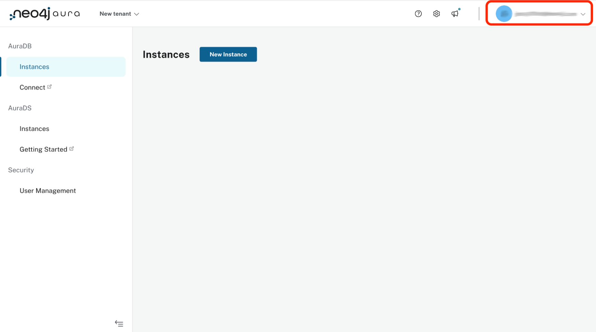
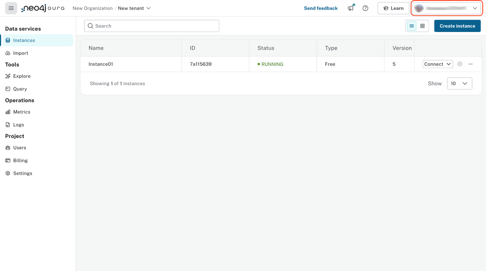
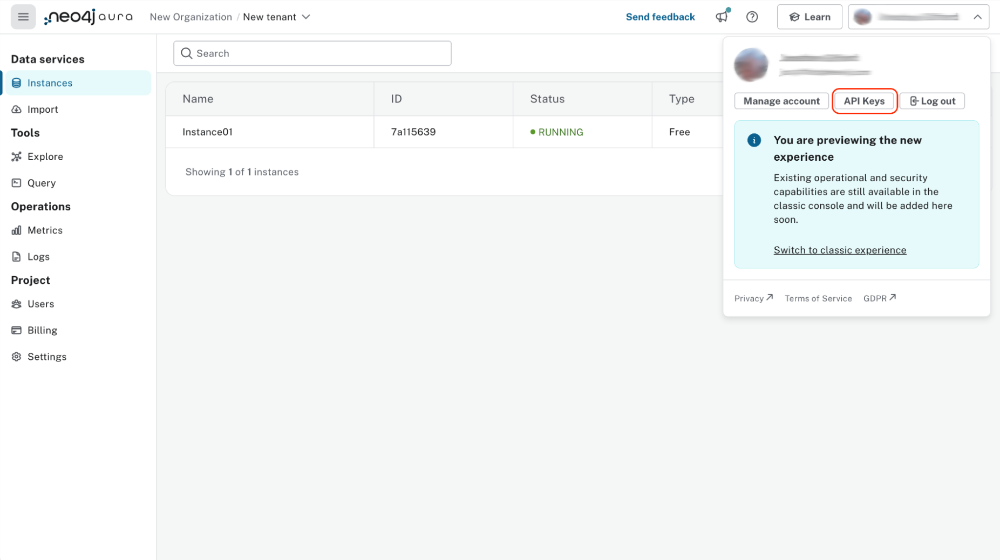
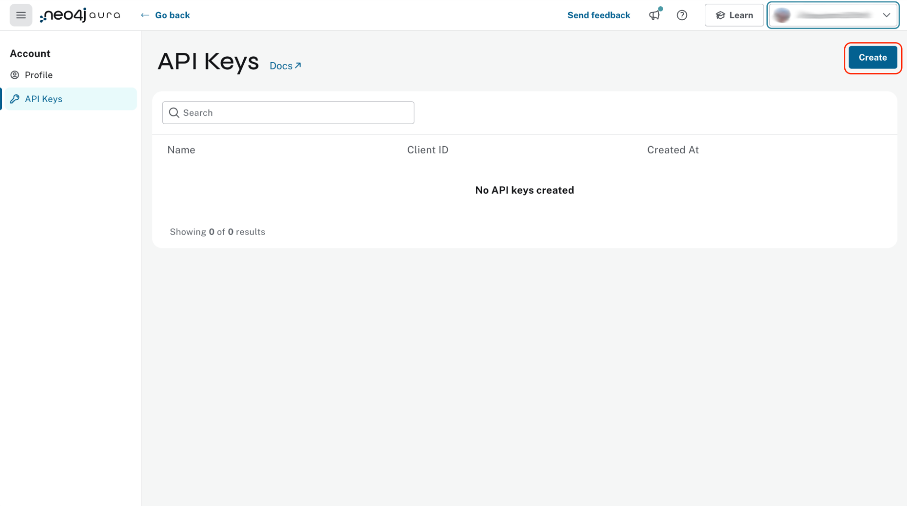
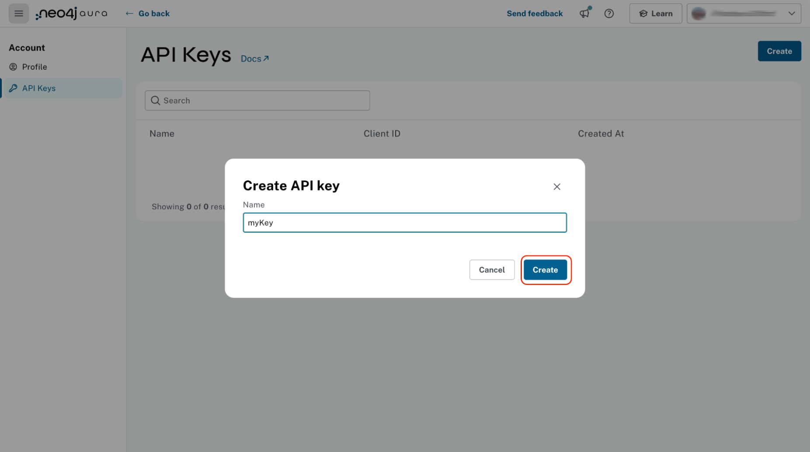

# A guide to the new Aura CLI

The new Neo4j Aura CLI is a powerful new tool designed to simplify and streamline the management of your Neo4j Aura resources directly from the command line.
Whether you're provisioning new databases or scaling existing ones, the Neo4j Aura CLI empowers developers and operations teams with greater flexibility, speed, and efficiency.
Built with ease of use in mind, this CLI bridges the gap between automation and hands-on control, enabling you to integrate Neo4j Aura seamlessly into your workflows.

# Installation

The new Aura CLI is available on [GitHub](https://github.com/neo4j/aura-cli/releases).
Choose the latest release and download the archive suitable for your platform and architecture of choice.
The CLI is fully compatible with Mac, Linux and Windows.

1. Using your browser, navigate to [https://github.com/neo4j/aura-cli/releases](https://github.com/neo4j/aura-cli/releases).

2. Download the compressed file that matches your computer. Make a note of the folder where the file is located.

3. After the file has been downloaded, extract the contents.

4. Open a command prompt and move to the location where you extracted the files.

5. Complete the installation by moving the aura-cli executable file into the file path.

- Mac users:  

```text
sudo mv aura-cli /usr/local/bin
```

- Windows users:

```text
move aura-cli c:\windows\system32
```

Check the installation with:

```text
aura-cli -v
```

You should see `aura version v1.0.0`.

**Note**: If you are using a Mac, you may receive a warning from Apple that aura-cli could not be verified. If this happens, open **System Settings**, select **Privacy & Security** on the left, and scroll down on the right. Select **Open Anyway**. This should not happen again. The aura-cli has been through the Apple certification process but it can take time to trickle down through the Apple ecosystem.

# Initial configuration

## Obtain an Aura API Key

**Note:** You need to have some form of payment information in your account to access this functionality. This also applies to Aura Free.

### Aura console classic

1. Login into the [Neo4j Aura Console](https://console.neo4j.io/).

2. Navigate to the top right where your account name is displayed. Click the down arrow.

    

3. In the a menu with your account name, click **Account Details**.  

4. In the **Account Details** display, click **Create** under **Aura API** and **Credentials**.

    

5. In the pop-up window, enter a client name, then click **Create**.

6. You will be shown the newly created client ID and client secret. Make sure to securely save these as they are required to use the Aura CLI.

### New unified Aura Console experience

1. Login into the [Neo4j Aura Console](https://console.neo4j.io/).

2. Navigate to the top right where your account name is displayed and click the down arrow.

    

3. In the menu, click **API Keys**.

    

4. In the **API Keys** window, click **Create**.

    

5. In the pop-up window, enter a name for the API key and click **Create**.

    

6. You will be shown the client ID and client secret. Make a note as the client secret will not be shown again and you need both. If you download them, keep them safe.

## Configure Aura CLI with an Aura API key

Configure the Aura CLI with the Aura API client ID and client secret you obtained earlier.
The Aura CLI refers to these as "credentials".
You can have several sets of credentials and  choose which one to use.

1. At the command prompt, enter the following, using your values for the items in CAPITALS:

    ```text
    aura-cli credential add --name YOUR\_LABEL --client-id YOUR\_CLIENT\_ID --client-secret YOUR\_CLIENT\_SECRET
    ```

2. To confirm the credentials are working, list your Aura instances:

    ```text
    aura-cli instance list --output table
    ```

# Working with AuraDB tenants

Aura CLI allows you to list the Aura tenants you can access and then obtain the available AuraDB instance for each one.
To list the tenants:  

```text
aura-cli tenant list
```

To get available AuraDB instances for an individual tenant, change `TENANT-ID` to the one you are interested in.
The output is substantial as all available AuraDB instance configurations are returned. 
Consider filtering the output, for example by using the [jq](https://jqlang.org/) utility.

```text
aura-cli tenant get TENANT-ID 
```

If you have a single tenant or one that you use most frequently, it is recommended that you set it as the default to avoid repetition with other Aura CLI commands.
Do this with:

```text
aura-cli config set default-tenant TENANT-ID 
```

# Working with subcommands that use organization ID and project ID instead of tenant ID

If you have a single organization ID and/or project ID or one that you use most frequently, it is recommended that you set it as the default to avoid repetition with other Aura CLI commands.
Do this with:

```text
aura-cli config set default-organization ORGANIZATION-ID
aura-cli config set default-project PROJECT-ID
```

# Managing AuraDB instances

The Aura CLI provides a full set of commands to manage the lifecycle of an AuraDB instance.

## Create

Before you can create an AuraDB instance, make sure that your desired configuration is available in a tenant where the AuraDB will reside.
Get these by using the tenant command from section [Working with AuraDB tenants](#working-with-auradb-tenants).
If you are using Aura Free, there is no need to do this as the configurations are fixed.
Create an AuraDB instance with:

```text
aura-cli instance create --name YOUR\_INSTANCE\_NAME --type free-db --await 
```

For other Aura tiers, provide the following:

- Instance name
- Memory
- Cloud provider
- Cloud region
- Type

You can find the values for these by using the tenant commands.
Once you have them, proceed with:

```text
aura-cli instance create --name YOUR_INSTANCE_NAME --cloud-provider YOUR_CLOUD_PROVIDER --region CLOUD_REGION --memory MEMORY --type  AURA_INSTANCE_TYPE --tenant-id YOUR_TENANT_ID 
```

You can skip `--tenant-id` if you have set a default tenant.

The response will provide the connection details for the request AuraDB which will contain authentication details, the username and password.
They are only shown once.
Make sure to record these safely and securely.

## List

Viewing AuraDB instances is achieved by using:

```text
aura-cli instance list
```

Use the table format output option to improve readability:

```text
aura-cli instance list --output table 
```

From the list, you can then use the ID for an AuraDB instance to get detailed information about it, including the URL to use for metrics:

```text
aura-cli instance get YOUR_INSTANCE_ID
```

## Update

A deployed AuraDB instance can have its name, memory or both changed.

```text
aura-cli instance update YOUR_INSTANCE_ID --name NEW_NAME  --memory NEW_MEMORY
```

You may omit `--name` and `--memory` as needed but at least one must be present.

## Delete

There's no confirmation required when using the aura-cli for deletion and the operation starts immediately.
Use with caution:

```text
aura-cli instance delete YOUR_INSTANCE_ID 
```

## Pause and resume

A paused AuraDB instance incurs a lower cost per hour than when it is running.
Pausing AuraDB instances when they are not in use and resuming them when needed is an effective mechanism for cost control.

### Pause

```text
aura-cli instance pause YOUR_INSTANCE_ID
```

### Resume

```text
aura-cli instance resume YOUR_INSTANCE_ID 
```

## Snapshots

A snapshot is a copy of an AuraDB instances data at a specific point in time.
It can then be restored with the `overwrite` command of the Aura CLI.  

### Create

An instance must be running for a snapshot to be created:

```text
aura-cli instance snapshot create --instance-id YOUR_INSTANCE_ID
```

### List

All of the snapshots for an AuraDB instance are returned in the response.

```text
aura-cli instance snapshot list --instance-id YOUR_INSTANCE_ID
```

### Get

To obtain the details for a single snapshot, use the `get` command:

```text
aura-cli instance snapshot SNAPSHOT_ID --instance-id YOUR_INSTANCE_ID
```

## Overwrite

You can overwrite the content of one AuraDB instance with the content of another while leaving the configuration as is.
However, the destination storage must be large enough.
Use a snapshot of the source AuraDB instance.
Overwrites can be used for restoration of an AuraDB instance databases, for duplication, moving between regions or any situation where you want to use the content of one AuraDB with another AuraDB.
Note that the content of the destination AuraDB instance is completely overwritten.

There is no confirmation for an overwrite.
Proceed with caution.

The steps to overwrite an existing AuraDB with the snapshot from another differs for a historical snapshot and the latest snapshot.
See the following sections.

In both cases, the destination AuraDB instance must be running.

### Steps for a historical snapshot

1. Obtain the ID of the AuraDB instance that has the desired snapshot you wish to use, referred to as the "source instance.

    ```text
    aura-cli instance list --output table  
    ```

2. Decide which of its snapshots to use and note the snapshot ID, referred to as source snapshot:

    ```text
    aura-cli instance snapshot list --instance-id SOURCE_INSTANCE_ID  
    ```

3. Locate the destination AuraDB instance and obtain its ID, referred to as the destination instance:

    ```text
    aura-cli instance list --output table
    ```

4. Perform the overwrite:

    ```text
    aura-cli instance overwrite DESTINATION_INSTANCE_ID --source-instance-id SOURCE_INSTANCE_ID  --source-snapshot-id SOURCE_SNAPSHOT_ID
    ```

If you receive a response that looks like the following, select a different snapshot:

```text
Error: [Source snapshot SOURCE_SNAPSHOT_ID is not exportable ]
```

It is not possible at this time for the Aura CLI to indicate which snapshots are exportable.

5. The destination AuraDB instance content will now be overwritten. Depending on the size, this will take several minutes to complete. You can check the status with:

    ```text
    aura-cli instance get DESTINATION_INSTANCE_ID 
    ```

When the status is "Running" the overwrite is completed.

### Steps for the latest snapshot

1. Locate the destination AuraDB instance and obtain its ID, referred to as the destination instance:

    ```text
    aura-cli instance list --output table
    ```

2. Perform the overwrite:

    ```text
    aura-cli instance overwrite DESTINATION_INSTANCE_ID --source-instance-id SOURCE_INSTANCE_ID
    ```

3. The destination AuraDB instance content will now be overwritten. Depending on the size, this will take several minutes to complete. You can check the status with:

    ```text
    aura-cli instance get DESTINATION_INSTANCE_ID 
    ```

When the status is "Running" the overwrite is completed.

## Customer-managed keys

Encryption of data at REST is a standard feature of AuraDB and uses keys from a supported cloud key management service (KMS).
AuraDB Virtual Dedicated Cloud customers may wish to use their own encryption keys, a capability that is referred to as Customer-Managed Encryption Keys (CMEK).
More information is available in the Aura documentation for [Encryption](https://neo4j.com/docs/aura/classic/platform/security/encryption/).
We advise you to read this before continuing.
The Aura CLI allows management of this feature with these commands:

-  `create` - allows Aura to use the key defined in your Cloud Key Management System.
- `delete` - removes the permission for Aura to use a key. This makes all data encrypted with that key inaccessible.
- `list` - lists already defined CMEKs.
- `get` - detailed information about an individual CMEK.

### Create

To use this command, you must have created your custom managed key in your cloud provider's Key Management System (KMS) and configured its permissions correctly.
This is explained in the Neo4j AuraDB documentation under [Encryption](https://neo4j.com/docs/aura/classic/platform/security/encryption/).

```text
aura-cli customer-managed-key create --tenant-id YOUR_TENANT_ID --type AURADB_TYPE --region CLOUD_REGION_OF_THE_AURADB_INSTANCE --name YOUR_CUSTOM_KEY_NAME  --key-id YOUR_CUSTOM_KEY_ARN --cloud-provider YOUR_CLOUD_PROVIDE_THAT_HAS_THE_CUSTOM_KEY
```

### Delete

This command executes immediately, resulting in a loss of data access by any AuraDB which is using the CMEK.  Use with caution:

```text
aura-cli customer-managed-key delete YOUR\_AURA\_CMEK\_ID
```

### List

List all configured CMEKs:

```text
aura-cli customer-managed-key list --tenant-id YOUR\_TENANT\_ID --output table
```

### Get

Provide detailed information for a particular CMEK:

```text
aura-cli customer-managed-key get YOUR\_CMEK\_ID
```

# Managing Fleet Manager deployments

The Aura CLI provides a full set of commands to manage Fleet Manager deployments.

## Example workflow

The workflow to setup a new monitored deployment is as follows:

Create a new deployment with the wanted properties.
```text
aura-cli deployment create --name DEPLOYMENT_NAME --connection-url DATABASE_CONNECTION_URL --organization-id YOUR_ORGANIZATION_ID --project-id YOUR_PROJECT_ID
```
Create a new Fleet Manager token with the wanted properties for the newly created deployment.
```text
aura-cli deployment token create --deployment-id DEPLOYMENT_ID --organization-id YOUR_ORGANIZATION_ID --project-id YOUR_PROJECT_ID
```
Then log into the Neo4j database that you want to monitor and register the new token with the `call fleetManagement.registerToken('TOKEN_HERE');` procedure

## Commands at a glance

Each command requires an organization and project ID parameter
```text
--organization-id YOUR_ORGANIZATION_ID --project-id YOUR_PROJECT\_ID
```
Create a new deployment (Connection URL is optional).
```text
aura-cli deployment create --name DEPLOYMENT_NAME --connection-url DATABASE_CONNECTION_URL --organization-id YOUR_ORGANIZATION_ID --project-id YOUR_PROJECT_ID
```
Delete a deployment.
```text
aura-cli deployment delete DEPLOYMENT_ID --organization-id YOUR_ORGANIZATION_ID --project-id YOUR_PROJECT_ID
```
Fetch information about the given deployment.
```text
aura-cli deployment get DEPLOYMENT_ID --organization-id YOUR_ORGANIZATION_ID --project-id YOUR_PROJECT_ID
``` 
List all deployments for a project.
```text
aura-cli deployment list --organization-id YOUR_ORGANIZATION_ID --project-id YOUR_PROJECT_ID
```

### Token subcommand
Create a token to register a deployment for Fleet Manager monitoring.
```text
aura-cli deployment token create --deployment-id DEPLOYMENT_ID --organization-id YOUR_ORGANIZATION_ID --project-id YOUR_PROJECT_ID
```
Recreate a token to override an existing token for a deployment.
```text
aura-cli deployment token update --deployment-id DEPLOYMENT_ID --organization-id YOUR_ORGANIZATION_ID --project-id YOUR_PROJECT_ID
```
Delete a token from a deployment to stop monitoring the deployment.
```text
aura-cli deployment token delete --deployment-id DEPLOYMENT_ID --organization-id YOUR_ORGANIZATION_ID --project-id YOUR_PROJECT_ID
```

### Database subcommand
List all logical databases for a deployment.
```text
aura-cli deployment database list --organization-id YOUR_ORGANIZATION_ID --project-id YOUR_PROJECT_ID
```

### Server subcommand
List all servers for a deployment.
```text
aura-cli deployment deployment server list --organization-id YOUR_ORGANIZATION_ID --project-id YOUR_PROJECT_ID
```

### Server database subcommand
List all physical databases for a deployment server.
```text
aura-cli deployment deployment server database list --organization-id YOUR_ORGANIZATION_ID --project-id YOUR_PROJECT_ID`
```

## Create

Create a new Fleet Manager deployment in your project. The command will return the deployment ID for the new deployment which can then be used in future commands to fetch information about the deployment or register it as a monitored deployment using the `token create` subcommand.

### Mandatory flags
- `organization-id`
- `project-id`
- `name`

### Optional flags
- `connection-url`

```text
aura-cli deployment create  --name DEPLOYMENT_NAME --connection-url CONNECTION_URL --organization-id YOUR_ORGANIZATION_ID --project-id YOUR_PROJECT_ID
```

## Delete

Delete a Fleet Manager deployment. This will also delete the associated token for the deployment if the deployment is being monitored.

```text
aura-cli deployment delete DEPLOYMENT_ID --organization-id YOUR_ORGANIZATION_ID --project-id YOUR_PROJECT_ID
```

## List
List all deployments

```text
aura-cli deployment list --organization-id YOUR_ORGANIZATION_ID --project-id YOUR_PROJECT_ID
```

## Get
Get details about the given deployment

```text
aura-cli deployment get DEPLOYMENT_ID --organization-id YOUR_ORGANIZATION_ID --project-id YOUR_PROJECT_ID
```

## Token

### Create

Create a token that can be registered to a Fleet Manager deployment using the Neo4j procedure `call fleetManagement.registerToken('CREATED_TOKEN');`.
The token will be created as an auto-rotating token with a three month rotation interval.

```text
aura-cli deployment token create --deployment-id DEPLOYMENT_ID --organization-id YOUR_ORGANIZATION_ID --project-id YOUR_PROJECT_ID
```

### Update

Renew the token for an existing monitored deployment. This command should only be needed if you need to manually rotate the token earlier than the set rotation interval. The newly created token should be registered to the same deployment using the Neo4j procedure `call fleetManagement.registerToken('CREATED\_TOKEN');`


```text
aura-cli deployment token update --deployment-id DEPLOYMENT_ID --organization-id YOUR_ORGANIZATION_ID --project-id YOUR_PROJECT_ID
```

### Delete

Delete the token from the given deployment. This will set the deployment back to an unmonitored state.

```text
aura-cli deployment token delete --deployment-id DEPLOYMENT_ID --organization-id YOUR_ORGANIZATION_ID --project-id YOUR_PROJECT_ID
```

## Database

### List
Get detailed information about all of the logical databases for the given deployment.

```text
aura-cli deployment database list --deployment-id DEPLOYMENT_ID --organization-id YOUR_ORGANIZATION_ID --project-id YOUR_PROJECT_ID
```

## Server

### List
Get detailed information about all of the servers for the given deployment.

```text
aura-cli deployment server list --deployment-id DEPLOYMENT_ID --organization-id YOUR_ORGANIZATION_ID --project-id YOUR_PROJECT_ID
```

## Server database

### List
Get detailed information about all of the physical databases on the given server.

```text
aura-cli deployment server database list --deployment-id DEPLOYMENT_ID --server-id SERVER_ID --organization-id YOUR_ORGANIZATION_ID --project-id YOUR_PROJECT_ID
```

## Troubleshooting

### Error: unknown command "deployment" for "aura-cli"

Make sure that you have set your CLI to run with beta enabled
```text
aura-cli config set beta-enabled true
```

### Deployment not found

Check that you are using the correct organization ID and project ID in the commands.

Make sure that you have the right deployment ID. You can verify that it exists by listing all the deployments in your project.
```text
aura-cli deployment list --organization-id YOUR_ORGANIZATION_ID --project-id YOUR_PROJECT_ID
```

### Failed to create a token for a deployment
Error: [failed to create api key: failed to save new api key: no rows in result set]

The token creation will fail if the deployment already has a token registered to it. To verify if a token already exists check the information given by:
```text
aura-cli deployment get DEPLOYMENT_ID --organization-id YOUR_ORGANIZATION_ID --project-id YOUR_PROJECT_ID
```

If there is a need to update the current token, a new one can be created with:
```text
aura-cli deployment token update --deployment-id DEPLOYMENT_ID --organization-id YOUR_ORGANIZATION_ID --project-id YOUR_PROJECT_ID
```

# Configuration of Aura CLI

Aura CLI has two commands for its own configuration:

 - `credential` - sets of client IDs and client secrets that are used to authenticate with the Aura API that the Aura CLI uses to perform its own operations.
 `config` - addtional configuration options for the Aura CLI, such as turning Beta features on or off.

## Credential

### Add

Adds a set of credentials, client ID and client secret, that were obtained from the Aura Console:

```text
aura-cli credential add --name YOUR_LABEL --client-id YOUR_CLIENT_ID --client-secret YOUR_CLIENT_SECRET
```

### List

Show all configured credentials that can be used by the Aura CLI:

```text
aura-cli credential list
```

### Remove

Remove a set of credentials:

```text
aura-cli credential list --name NAME_TO_REMOVE
```

### Use

Set the default credentials for the Aura CLI to use:

```text
aura-cli credential use --name NAME_TO_USE
```

## Config

There are various configuration settings that can be controlled by this command, for example, enabling beta features.

### List

Show the current configuration settings:

```text
aura-cli config list
```

### Get

Show the value of a chosen setting:

```text
aura-cli config set SETTING\_NAME
```

#### Set

Set the value for a chosen setting:

```text
aura-cli config set SETTING_NAME SETTING_VALUE
```

# Migrating to the new Aura CLI

Aura CLI  has evolved from a Neo4j Labs to a proper Neo4j product.
The Neo4j Labs Aura CLI will continue to be available for installation for the foreseeable future, but without any further development.
Customers are recommended to move to the new Aura CLI as soon as they are able to do so.
This KB outlines what you need to consider to move the new Aura CLI.

## Behavior

- The name of the CLI is now "aura-cli".
- Support for using environmental variables has been removed as they can be visible in process listings and can be accidentally logged making them vulnerable to exposure. For sensitive values e.g. Aura API client ID and client secret, a secrets manager is recommended.
- Neo4j Labs Aura CLI used plural names for commands; the new Aura CLI has singular naming instead.
- It is not possible to return the raw API response body with the new Aura CLI
- Flags with the new Aura CLI do not have a short form and must be specified in full length.

## Feature set

At the time of general availability, the new Aura CLI supports these new features compared to the previous Labs project:

- Customer-managed keys
- Beta of GraphQL Data APIs

## Installation

Download the new Aura CLI from [https://github.com/neo4j/aura-cli/releases](https://github.com/neo4j/aura-cli/releases).
It is available as a native binary for Windows, Linux and Mac platforms.
After downloading the relevant file and extracting the executable, the new Aura CLI can be run immediately; there are no dependencies.

## Commands

| Labs Aura CLI                      | maps to  | New Aura CLI                                                       |
|------------------------------------|----------|--------------------------------------------------------------------|
| config                             | →        | config                                                             |
| credentials                        | →        | credential                                                         |
| instances                          | →        | instance                                                           |
| snapshots                          | →        | instance -> snapshot                                               |
| tenants                            | →        | tenant                                                             |
| tenants -> get-metrics-integration | →        | instance get \<InstanceID> returns the URL for metrics integration |
|                                    |          | NEW - customer-managed-key                                         |
|                                    |          | NEW - graph-analytics                                              |
|                                    |          | NEW - data-api  ( beta )                                           |

## Command and flag changes with new Aura CLI

As far as was possible, the new Aura CLI commands and their flags are the same as for the Labs based Aura CLI.
However, there are some changes.
See the following sections.

## Config

It is not possible to remove a setting and its value although the value itself can be changed.
If deletion is wanted, then remove it from the JSON configuration file _Mac$HOME/Library/Preferences/neo4j/cli/config.json_ Windows%LOCALAPPDATA%\neo4j\cli\config.json

## Create a new AuraDB

When creating an Aura instance with the new Aura CLI, the memory size is specified with an integer appended with "GB" e.g. "8GB". Previously, this was just the integer.

## Delete an AuraDB

The new Aura CLI does not prompt for confirmation when deleting an AuraDB and starts the operation immediately.

## Update an AuraDB

Only the ID can be used to identify the AuraDB to update.
The same properties can be changed as previously: its name and memory size.

## Get AuraDB instance details

This now includes the URL to obtain metrics.

## Tenants

This command no longer includes a flag to obtain metric integration information.
It is also now part of the details returned for an individual AuraDB. 
See Get AuraDB instance details.

## Snapshots

Management of snapshots is now a sub-command of instance and allows for their creation, listing and obtaining their details.
Restoration of a snapshot is performed by using the aura-cli instance overwrite command.

# Feedback

Report feedback via [GitHub issues](https://github.com/neo4j/aura-cli/issues).
This covers requested enhancements, defects that you may encounter and general feedback.
